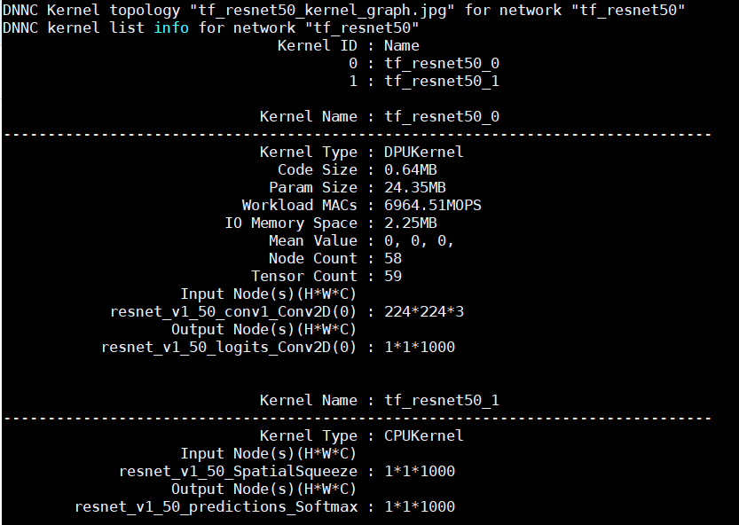
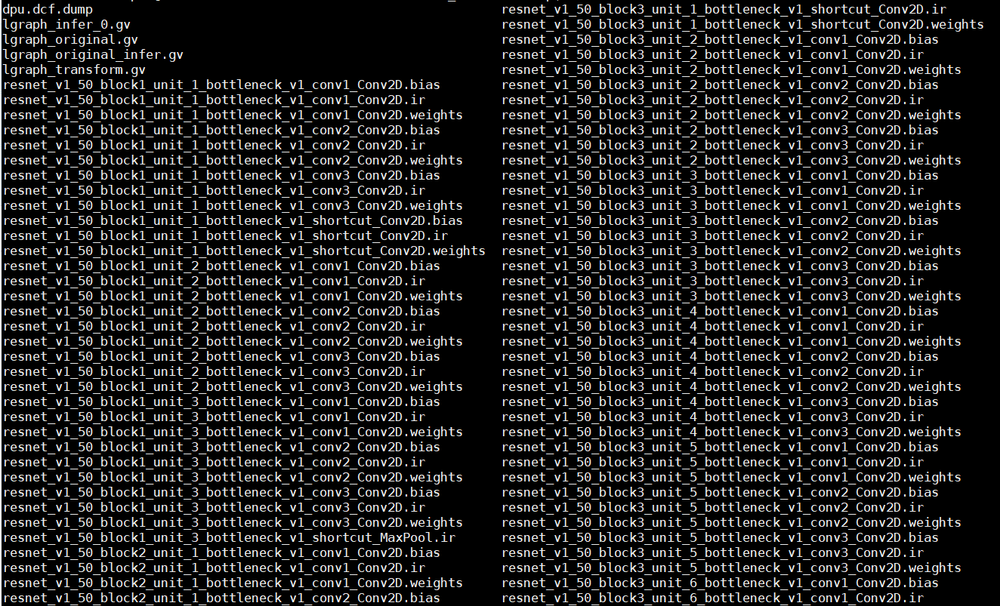
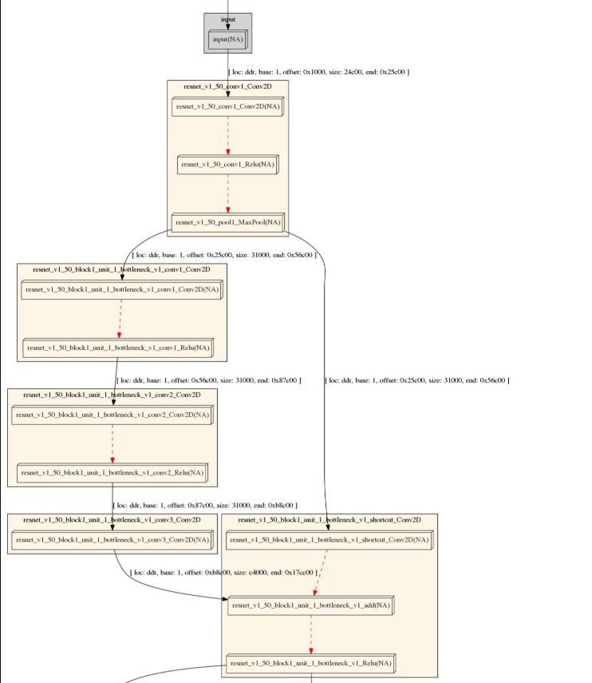

# TensorFlow Workflow

## 1. Prerequisite 
### Host environment 

Please setup the environment according to Chapter 1 of [UG1327](https://www.xilinx.com/support/documentation/sw_manuals/ai_inference/v1_6/ug1327-dnndk-user-guide.pdf).

### Board environment

For avaliable Xilinx evalution boards, please make sure board image and DNNDK are correctly installed and configured according to Chapter 1 of [UG1327](https://www.xilinx.com/support/documentation/sw_manuals/ai_inference/v1_6/ug1327-dnndk-user-guide.pdf).

For custom FPGA platform, please make sure DPU and DNDNK are correctly implemented based on [DPU TRD](https://www.xilinx.com/member/forms/download/design-license-xef.html?filename=zcu102-dpu-trd-2019-1-190809.zip). 

Related files can be downloaded in [Xilinx AI Developer Hub](https://www.xilinx.com/products/design-tools/ai-inference/ai-developer-hub.html#edge).

### Tool

This tutorial requires TensorFlow decent_q released in [DNNDK 3.1](https://www.xilinx.com/member/forms/download/dnndk-eula-xef.html?filename=xilinx_dnndk_v3.1_190809.tar.gz) on Xilinx AI Developer Hub.

### Model

Resnet50 from [Xilinx Model Zoo](https://github.com/Xilinx/AI-Model-Zoo) is used in this tutorial. The pb file is already placed in `GPU-DPU-cross-check/tf_resnet50/quantized_model/` and complete ResNet50 package can be downloaded in [here](https://www.xilinx.com/bin/public/openDownload?filename=tf_resnet50_imagenet_224_224_6.97G.zip).

## 2. Generate Reference Result

Under folder `tf_resnet50`, run `0_dump.sh` to generate reference data.

```
decent_q dump --input_frozen_graph quantize_model/quantize_eval_model.pb \
              --input_fn resnet_v1_50_input_fn.dump_input \
              --output_dir=dump_gpu \
```

After running the script, folder "dump_gpu" will be generated and partial files are shown as below. 


## 3. Generate DPU Inference Result

### Generate DPU elf file
Run script `1_compile.sh` to genereate DPU elf file. Please modify `dcf` parameter according to your board.

```
dnnc-3.1 --parser=tensorflow \
         --dcf=../dcf/ZCU102.dcf \
         --frozen_pb=quantize_model/deploy_model.pb \
         --cpu_arch=arm64 \
         --output_dir=compile_model \
         --net_name=tf_resnet50 \
         --mode=debug \
         --save_kernel \
         --dump all
```




Files dumped for analysis purpose are stored in folder `dump` whose contents are as follow:





With internal function of DNNC, the relationship between DPU super layers and actual network layers could be generated as [TensorFlow ResNet50 Super Layer](../tf_resnet50/kernel_graph.jpg).


### Generate DPU inference result
Transfer folder `/board_tf` onto board system and generate executable `tfcd f-resnet50` by command: 
```
make
``` 

Enable DPU debug mode with DNNDK dexplorer (detailed information is in Chapter 11 of [UG1327](https://www.xilinx.com/support/documentation/sw_manuals/ai_inference/v1_6/ug1327-dnndk-user-guide.pdf)):
```
dexplorer -m debug
```

Run DPU inference with reference input data `input_aquant_int8.txt` by below command and inference result of layers will be save in folder `dump_xxx`, the partial files are shown below. 
```
tf-resnet50 input_aquant_int8.txt
```


## 4. Cross Check Inference Result

### Understand layer correspondence between refenecne result and DPU inference result
When DNNC generates elf file, it will conduct several optimization strategies on certain layer conbinations and form super layers so as to get better performance. In order to cross check inference result correctness, [super layer graph](../tf_resnet50/kernel_graph.jpg) will be used to find correct files to cross check. 

.

Take first several layers of TensorFlow resnet shown above as example. The names of DPU super layers are shown on the top of every blocks (e.g, `resnet_v1_50_conv1_Conv2D`) while the names of network layers are shown in every blobs (e.g, `resnet_v1_50_conv1_Conv2D, resnet_v1_50_conv1_Relu, resnet_v1_50_pool1_MaxPool`). 


block #1: resnet_v1_50_conv1_Conv2D

block #5: resnet_v1_50_block1_unit_1_bottleneck_v1_shortcut_Conv2D


Super Layer Name| Reference file            | DPU file
----------------|:---------------------------|:------------
block#1 (input)   | input_aquant_int8.bin        | tf_resnet50_0_resnet_v1_50_conv1_Conv2D_in0.bin   
block#1 (output)  | resnet_v1_50_pool1_MaxPool_aquant_int8.bin | tf_resnet50_0_resnet_v1_50_conv1_Conv2D_out0.bin 
block#5 (input0)   | resnet_v1_50_pool1_MaxPool_aquant_int8.bin | tf_resnet50_0_resnet_v1_50_block1_unit_1_bottleneck_v1_shortcut_Conv2D_in0.bin
block#5 (input1)   | resnet_v1_50_block1_unit_1_bottleneck_v1_conv3_BatchNorm_FusedBatchNorm_add_aquant_int8.bin| tf_resnet50_0_resnet_v1_50_block1_unit_1_bottleneck_v1_shortcut_Conv2D_in1.bin
block#5 (output)  | resnet_v1_50_block1_unit_1_bottleneck_v1_Relu_aquant_int8.bin              | tf_resnet50_0_resnet_v1_50_block1_unit_1_bottleneck_v1_shortcut_Conv2D_out0.bin


### Cross check reference result and DPU inference result

The cross check mechinism is to first make sure input(s) to one super layer is identicial to reference and then the output(s) is identical too, which can be done with command `diff`, `vimdiff`, `cmp` and etc. If two files are identical, command `diff` and `cmp` will return nothing in command line. 

For example as the initial step, the inputs of super layer `resnet_v1_50_conv1_Conv2D` need to be compared and should be exactly same. Then the outputs of super layer 'resnet_v1_50_conv1_Conv2D' should be compared and so on. 

For super layers that have multiple input or output (e.g., `resnet_v1_50_block1_unit_1_bottleneck_v1_shortcut_Conv2D`), input correctness should be checked first and then check output. 


### Files to submit if cross check fails

If certain super layer proves to be wrong on DPU, please prepare following files as one package for further analysis by factory and send to shuaizh@xilinx.com with detailed descrption.  

- dpu.dcf.dump file generated by DNNC
- .ir file genereated by DNNC
- super layer input file (.bin) and output file(bin) generated by DPU 
- DNNC tag info generated by `dnnc-xxx --tag`


For example, if super layer `resnet_v1_50_conv1_Conv2D` is not running correctly, following files shall be collected: 

- dpu.dcf.dump
- resnet_v1_50_conv1_Conv2D.ir
- tf_resnet50_0_resnet_v1_50_conv1_Conv2D_in0.bin and tf_resnet50_0_resnet_v1_50_conv1_Conv2D_out0.bin
- DNNC tag info 
